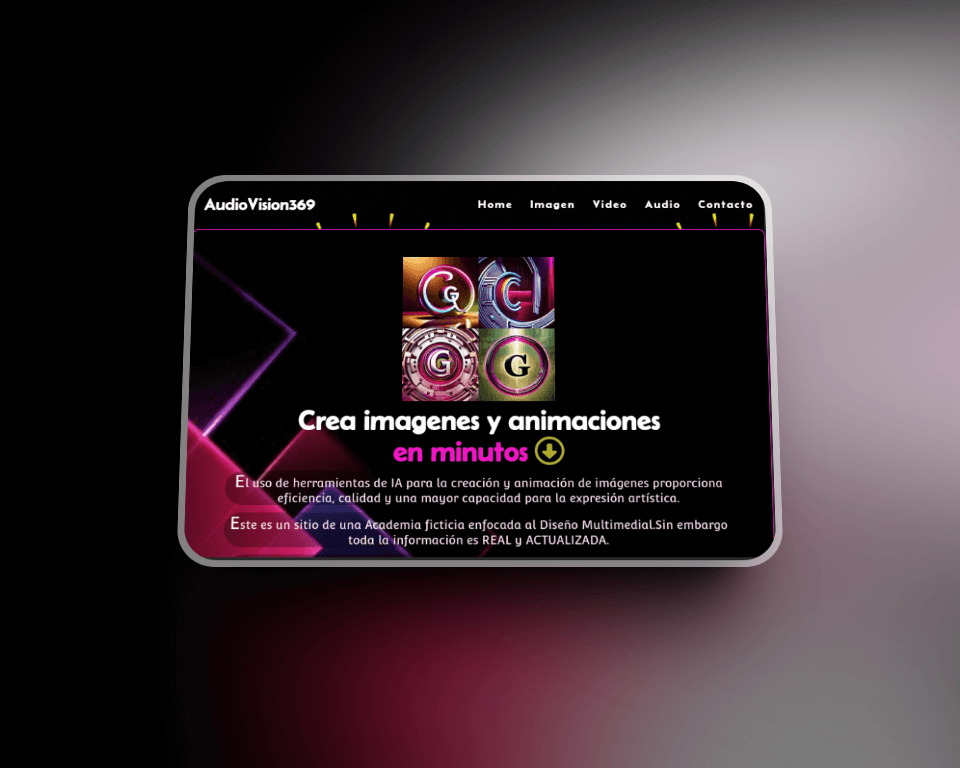

# Primer Página Web

## Descripción del Proyecto
Esta página es de carácter informativo, basada en datos reales, acerca de las ventajas que ofrece la IA para diseño y edición. Refiere a una Academia multimedial ficticia.
El sitio ha sido construido utilizando HTML y CSS (uso de metodología BEM), integración con Sass y un script sencillo para agregar funcionalidades adicionales.
Es importante mencionar que aún existen algunos errores que se deben abordar. Algunos de ellos son la maquetación, optimización de rendimiento e implementaciones de seguridad.

[SitioWeb](https://crysg011.github.io/SitioWeb/) 

Funcionalidades

La página "AudioVision369" actualmente ofrece las siguientes funcionalidades:

Presentación:
- Información sobre herramientas de diseño con IA que aceleran la producción.

- Slider de imagenes creadas con IA.

- Sección para proyectos de video con IA. Avances en plataformas y aplicaciones para edición de audio.

- Formulario de contacto para solicitar más información sobre la sección de su interés.

[Linkedin](https://www.linkedin.com/in/crystina-g-cristina-gonzalez-9337b0233/)
